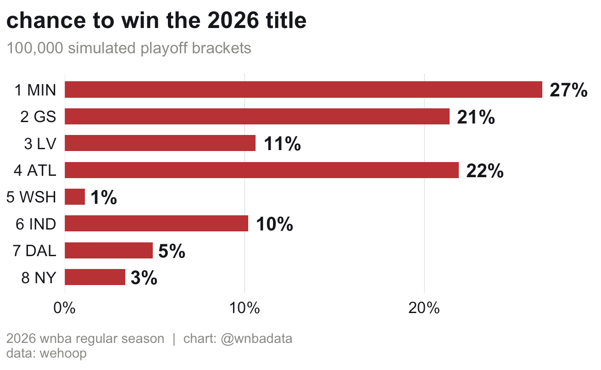
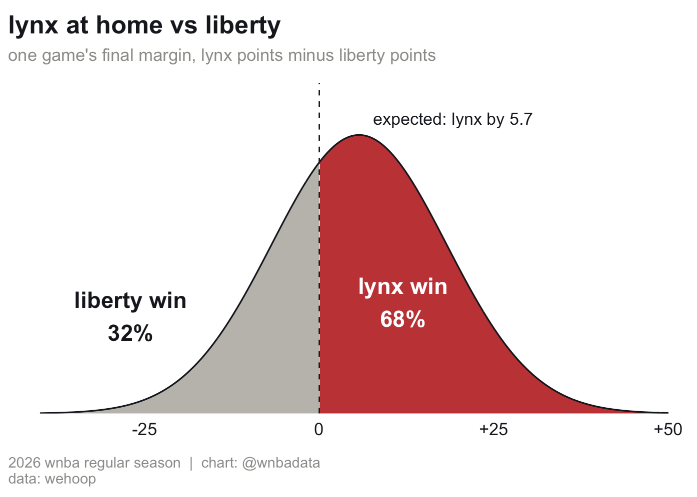
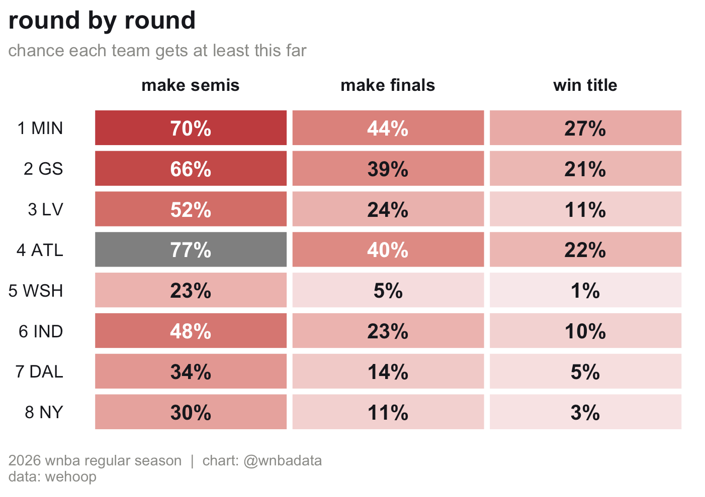
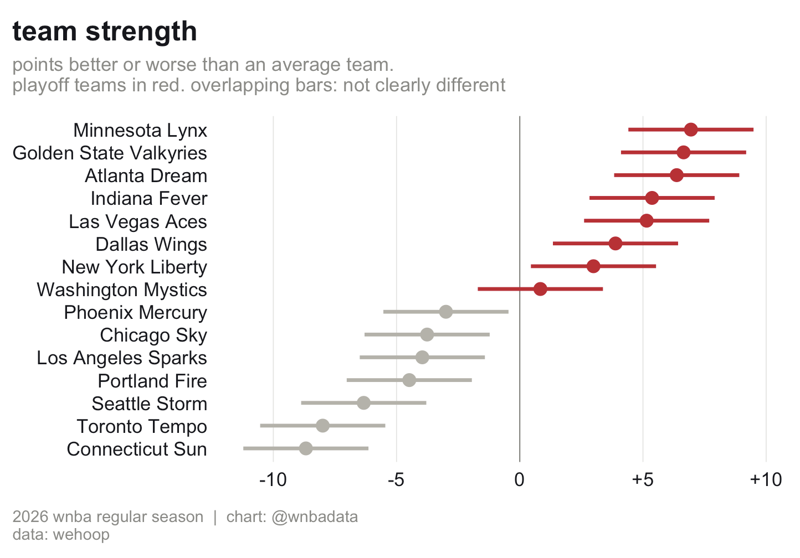
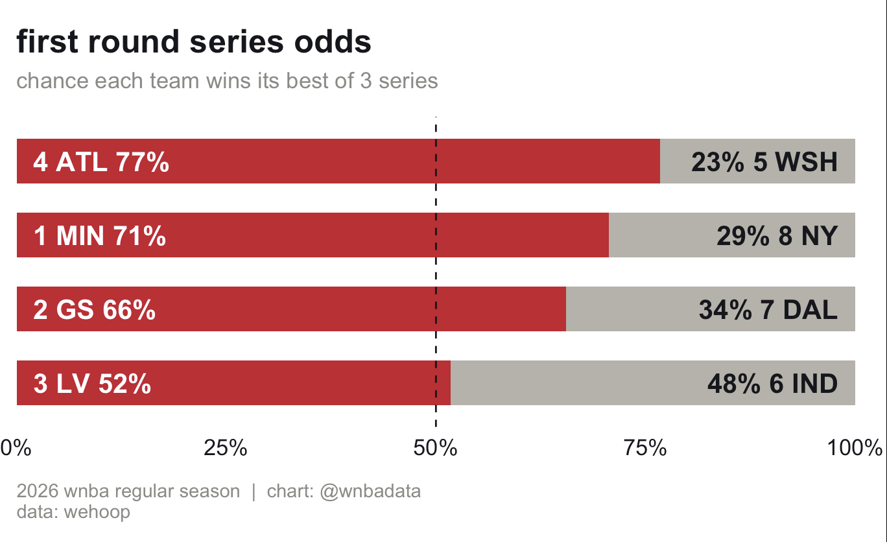

# Can anyone beat the Lynx?

**A Bradley-Terry model fit to all 330 games of the 2026 WNBA regular season, then used to
simulate the playoff bracket 100,000 times. The Lynx are the favorite at 27%, which means
they still lose the title almost 3 out of 4 times.**

Video explainer: [@wnbadata](https://www.instagram.com/p/Dduq-BJv_iV/).



## The data

Every 2026 regular season game from `wehoop::load_wnba_team_box(seasons = 2026)`: 330
games, 15 teams, with the All-Star game and the Commissioner's Cup final removed. Seeds and
the playoff format (best of 3, then best of 5, then best of 7, fixed bracket) come from the
[2026 WNBA playoffs](https://en.wikipedia.org/wiki/2026_WNBA_playoffs) page.

## The method

Each team gets one strength, λ, and every game's margin is modeled as

```
margin = home court + λ_home - λ_away + noise,   noise ~ Normal(0, σ²)
```

This is the margin version of the Bradley-Terry model, fit with least squares on a matrix
with one row per game (+1 for the home team, -1 for the away team). Margins carry more
information than wins and losses, so the ratings come out tighter from the same games.

```r
fit <- lm(games$margin ~ X)
```

To compare any two teams, the strength chart uses quasi standard errors (`qvcalc`), with
bars of ±1.39 quasi SEs so two bars stop overlapping exactly when the gap is significant at
the 5% level.

A single game's win probability is the chance the margin lands above 0:



Series probabilities are computed exactly from those game probabilities, with the right
home team in each game, and the full bracket is simulated 100,000 times.

## The finding

**The Lynx are the most likely champion at 26.6%, with the Dream (21.9%) and Valkyries
(21.4%) basically tied behind them.** No other team is above 11%.



**The top seven teams are within 4 points of each other,** Minnesota (+6.9 vs an average
team) to New York (+3.0). Two teams need to be about 5 points apart before the model can
tell them apart. Washington (+0.8) is the lowest rated playoff team despite a 28-16 record,
because it went 12-5 in games decided by 5 or fewer but outscored opponents by only 1.3 a
game.



**The 3 vs 6 series is a coin flip.** The model rates Indiana slightly higher than Las
Vegas, so Vegas wins only 52% of the time, almost entirely because of home court (worth
1.75 points).



## Caveats

- **No injuries, rest or roster changes.** Every team has one strength for the whole
  season.
- **The odds are a bit overconfident.** The simulation treats the estimated strengths as
  exact, and with teams this close, accounting for that uncertainty would pull every team
  toward the middle.
- **Blowouts count fully,** and games are assumed independent with normally distributed
  margins.

## Run it

```r
source("bt-margin.R")
```

Requires: `wehoop`, `dplyr`, `tidyr`, `ggplot2`, `qvcalc`, `scales`.

## References

- Scott Powers, [SMGT 430: Introduction to Sport Analytics](https://saberpowers.com/teaching/smgt430/), chapter 3
- Heather Turner and David Firth (2012), [Bradley-Terry Models in R: The BradleyTerry2 Package](https://doi.org/10.18637/jss.v048.i09), *Journal of Statistical Software*
- David Firth and Renée de Menezes (2004), [Quasi-variances](https://doi.org/10.1093/biomet/91.1.65), *Biometrika*
