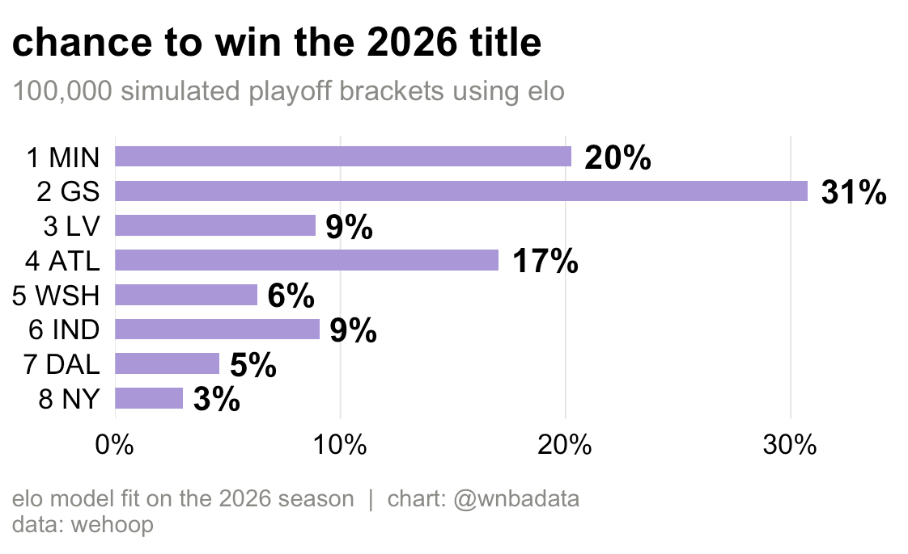
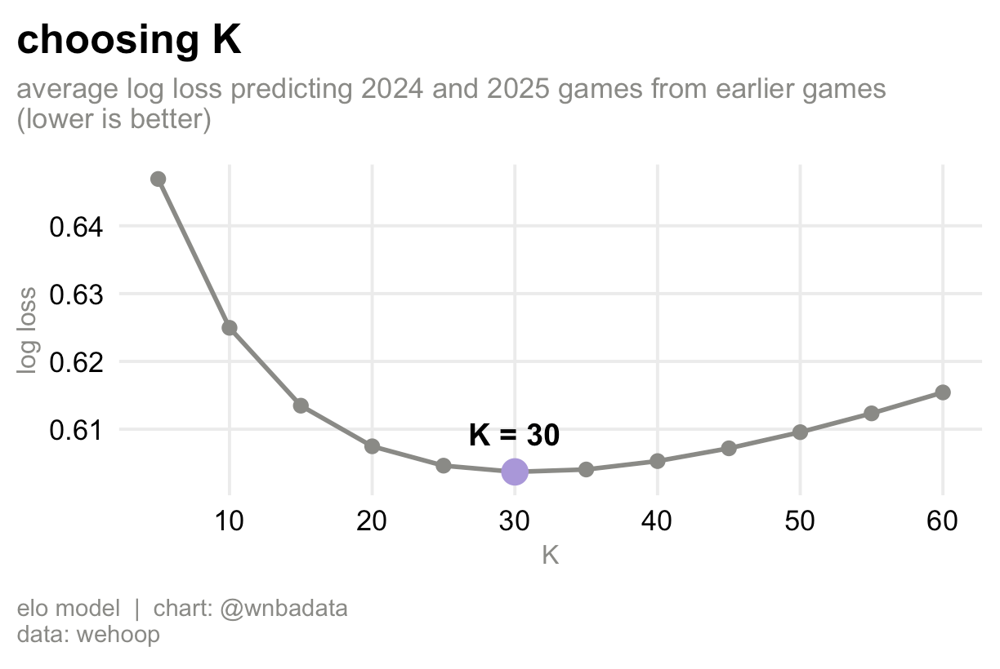
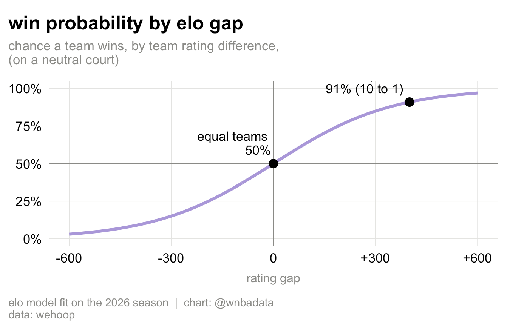
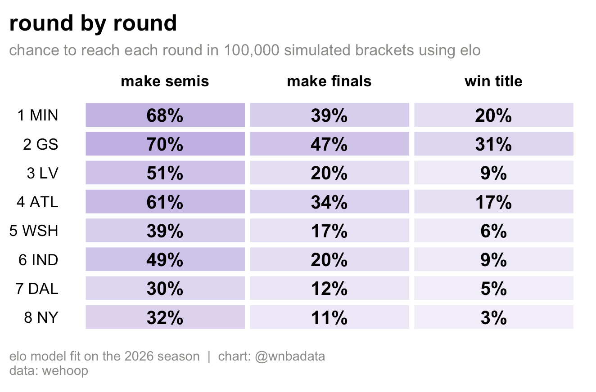
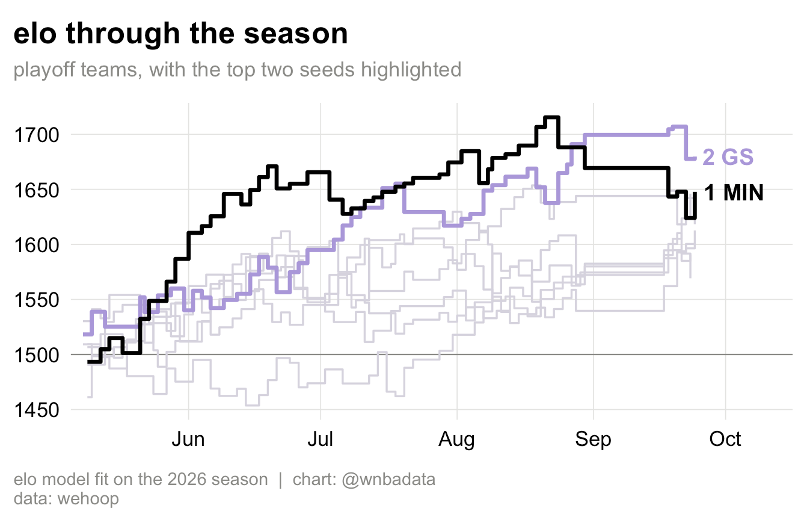
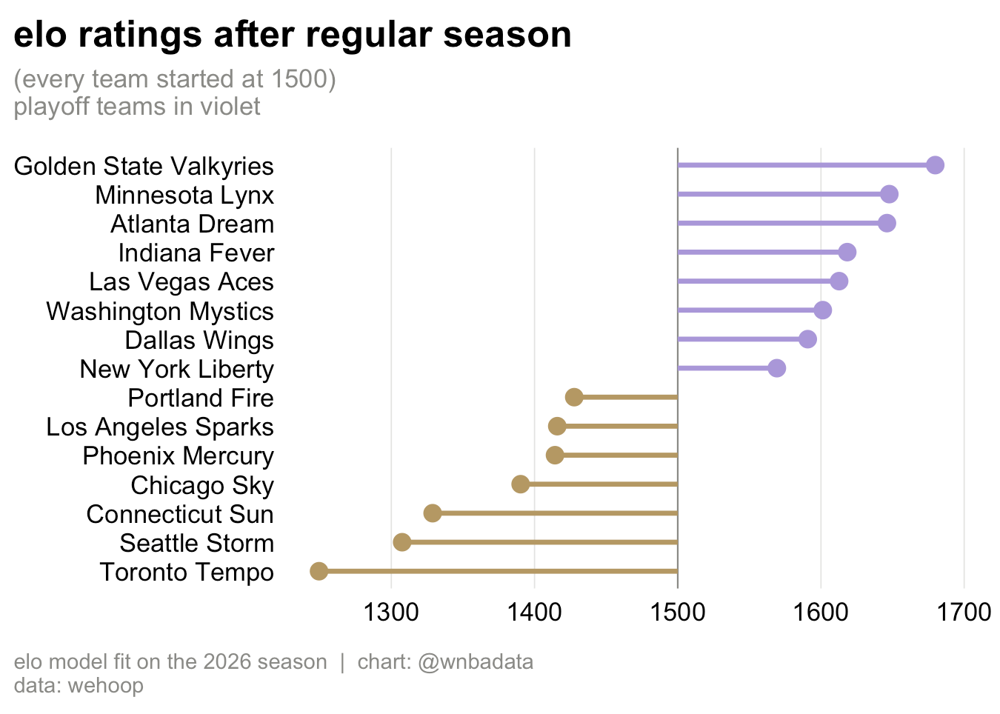
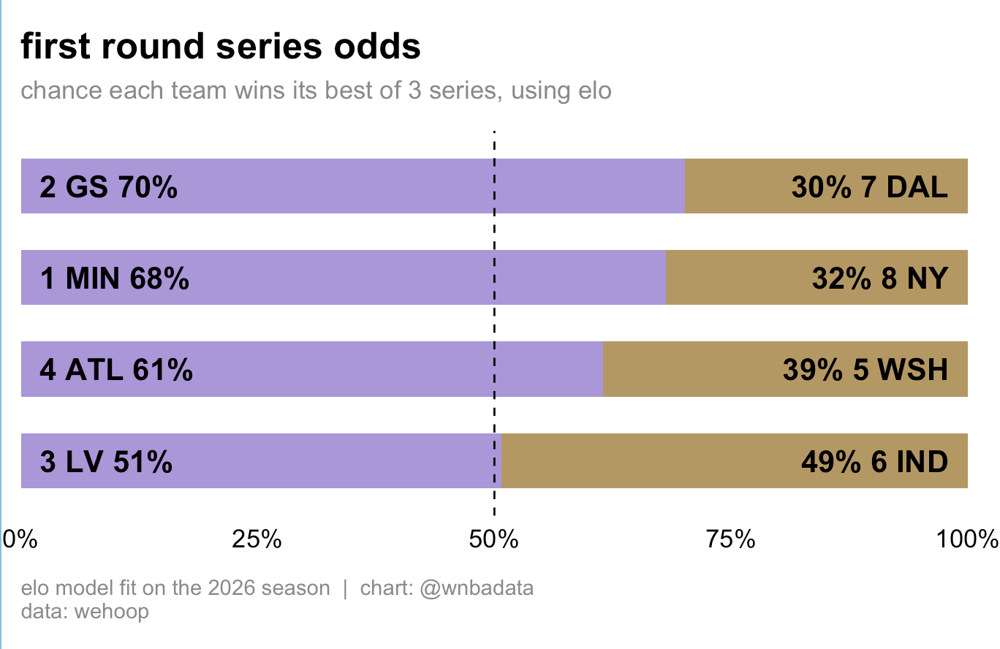

# Who wins the 2026 WNBA title if recent games count more?

**An Elo rating system run over all 330 games of the 2026 WNBA regular season, then used to
simulate the playoff bracket 100,000 times. The Valkyries are the favorite at 31%, ahead of
the Lynx (20%), because Elo weights how teams finished (more recent games) over how they started (older games). That's in contrast with the [Bradley-Terry model](../bradley-terry-playoff-sim), which weighted every
game equally and had the Lynx as the favorite (27%).**

Video explainer: [@wnbadata](https://www.instagram.com/p/DdxUSGXz8DB/).



## The data

Every 2026 regular season game from `wehoop::load_wnba_team_box(seasons = 2026)`: 330
games, 15 teams, with the All-Star game and the Commissioner's Cup final removed (found
through the schedule's game notes). Seeds and the playoff format (best of 3, then best of 5,
then best of 7, fixed bracket) come from the
[2026 WNBA playoffs](https://en.wikipedia.org/wiki/2026_WNBA_playoffs) page.

## The method

Every team starts the season at 1500. Before each game, the rating gap gives a win
probability, with every 400 points of gap equal to 10 to 1 odds:

```
expected = 1 / (1 + 10^(-(elo_home + home court - elo_away) / 400))
```

After the game, the winner takes points from the loser:

```
change = K * mult * (result - expected)
```

- `result` is 1 for a win and 0 for a loss, so upsets move ratings more than expected wins.
- `mult` is the margin-of-victory multiplier from FiveThirtyEight's NBA Elo. Bigger wins
  move ratings more, with diminishing returns, and less when a heavy favorite wins big. It
  was designed for the NBA and isn't re-tuned for the WNBA here; only K is.
- `K = 30`, chosen by predicting 2024 and 2025 games walk-forward style: each game is
  predicted from the ratings going into it, and every game after the first third of the
  season is scored with log loss. `tune-k.R` reproduces this. Anything from about 25 to 40
  does almost as well, and much lower K is clearly worse.
- Home court is 27 Elo points, set so two equal teams match the 2026 home win rate (53.9%).
  `elo-sim.R` computes it directly from the data.

Because ratings update one game at a time, each new game slowly overwrites the old ones, so
recent games count much more than games from May.





Series probabilities are computed exactly from the game probabilities, with the right home
team in each game, and the full bracket is simulated 100,000 times.

## The finding

**The Valkyries are the most likely champion at 30.7%, then the Lynx (20.3%) and Dream
(17.0%).** No other team is above 10%.



**The Lynx led most of the season, but the Valkyries finished stronger.** Minnesota was
the top rated team on 79 of 111 game days and peaked at 1715 on August 21. Golden State took
over on August 27 and stayed on top. By margin, the Lynx went from +8.6 a game in their first
29 games to +4.4 in their last 15, while the Valkyries went from +5.7 to +9.7.



**The top is still close.** The Valkyries finish 32 points ahead of the Lynx, and one game
moves a team about 12 points, so a single Lynx win by 10 in San Francisco would flip
them.



**The 3 vs 6 series is still a coin flip.** Las Vegas beats Indiana 51% of the time.



**Neither model is clearly better... for now.** Predicting each 2026 game from only the games before
it (224 games after the first third of the season), Elo and the Bradley-Terry model were
statistically tied. They disagree about the favorite because they disagree about whether
recent games should count more, not because one predicts better.

## Caveats

- **No injuries, rest or roster changes are taken into account,** except as they show up in results.
- **No uncertainty in the ratings.** Elo gives a single number per team, and the simulation
  treats it as exact (unlike the Bradley Terry model, which lets us calculate errors more easily.)
- **K was tuned on only two seasons,** and values from about 25 to 40 did almost equally
  well.
- **Every team starts 2026 at 1500.** Carrying ratings over from 2025 barely changes the
  end of season numbers (the top five move by about 5 points), but it does change early
  season ratings. We would certainly see different results if we started the Elo ratings 
  from the beginning of WNBA history in 1997.

## Run it

```r
source("elo-sim.R")   # ratings, playoff odds and charts
source("tune-k.R")    # how K was chosen
```

Requires: `wehoop`, `dplyr`, `tidyr`, `ggplot2`, `scales`.

## References

- Amy N. Langville and Carl D. Meyer (2012), *Who's #1? The Science of Rating and Ranking*, Princeton University Press, chapter 5 (Elo's system)
- Nate Silver and Reuben Fischer-Baum (2015), [How We Calculate NBA Elo Ratings](https://web.archive.org/web/20150617051529/http://fivethirtyeight.com/features/how-we-calculate-nba-elo-ratings/), FiveThirtyEight (Web Archive)
