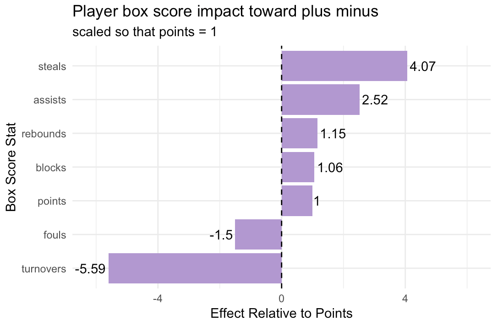

# What is a steal actually worth?

**Ridge regression on WNBA player box scores, 2024 through 2026, scaled so that one point
equals 1.**

Inspired by Benjamin Morris's
["The Hidden Value of the NBA Steal"](https://fivethirtyeight.com/features/the-hidden-value-of-the-nba-steal/)
(FiveThirtyEight, 2014), which found a steal in the NBA is worth around nine points. I
wanted to know what the number looks like in the W.

Video explainer: [@wnbadata on Instagram](https://www.instagram.com/reels/DXHsCdHzywf/).



## The question

When I started @wnbadata in 2022, one of the first things I made was a week of videos
about Gabby Williams, and my argument was that she was underrated. Not for her scoring,
for her steals. She led the league with 99 of them, 2.3 a game.

It's obvious that a steal is good. You take a scoring chance away from the other team and
usually get an easy one for yourself. The question is how good, compared to the thing
everybody actually counts and the stat that actually wins games, which is points.

## The data

`wehoop::load_wnba_player_box()`, one row per player game, filtered to players who were
active and actually played.

As of writing, plus-minus for players in wehoop only exists from 2024 on. Even
within 2024 onward it was only recorded about 84% of the time, and after dropping incomplete
rows we have 8,779 player games. We drop the rows where PM was not recorded.

## The method

Ridge regression (`glmnet` with `alpha = 0`), predicting a player's plus-minus in a game
from their points, rebounds, assists, steals, blocks, turnovers and fouls.

Ridge rather than plain least squares because these stats are heavily correlated with each
other. Minutes drives all the counting stats, points and shot attempts are extremely correlated, and ordinary regression handles that by handing out big unstable coefficients that can flip sign.
Ridge shrinks correlated predictors toward each other instead of arbitrarily picking a
winner.

Lambda comes from 10 fold cross validation rather than me choosing it:

```r
set.seed(123)
ridge_cv <- cv.glmnet(X, y, alpha = 0, nfolds = 10, standardize = TRUE)
ridge_model <- glmnet(X, y, alpha = 0, lambda = ridge_cv$lambda.min)
```

Cross validation picks the penalty strength, but not much else. Once lambda is chosen the model gets refit on all the data.

This lands on lambda = 0.167. Then every coefficient gets divided by the points
coefficient, so everything reads as "worth this many points."

## The finding

| Stat | Worth, in points |
|---|---|
| Steal | 4.07 |
| Assist | 2.52 |
| Rebound | 1.15 |
| Block | 1.06 |
| Point | 1.00 |
| Foul | -1.50 |
| Turnover | -5.59 |

A steal is worth about 4 points. For Gabby Williams at 2.3 steals a game, that's roughly 9
points a game of impact.

But the biggest number in the table is negative. A turnover costs about 5.6 points, more
than a steal gains. The two largest effects are both possession events, and giving the
ball away hurts more than taking it helps. That matches what I found in
[which stats actually matter](../which-stats-actually-matter/), where turnover rate was
the worst thing in the box score to lead a game in.

The gap between steals (4.07) and blocks (1.06) is the other thing worth sitting with.
They get talked about like a matched pair of defensive stats, but a steal always changes
possession and a block often doesn't. The model rates a steal about four times a block,
which is Morris's whole argument holding up in a different league.

Assists at 2.5 means the pass that creates the basket grades higher than the basket.

My 4 is well below Morris's roughly 9 for the NBA. Different league, different pace, and a
much smaller sample, so I don't read too much into the exact gap, but the ordering is
the same: steals are worth far more than the box score treats them.

## Caveats

Plus-minus is mostly about who you play with. The players whose actual plus-minus most
beats what the model predicts are Leonie Fiebich and Betnijah Laney-Hamilton from the Liberty, a pretty good team. The ones it most overrates are Saniya Rivers, Hailey Van Lith,
Elizabeth Williams, Kamilla Cardoso, Azura Stevens and Arike Ogunbowale, which are mostly players on teams who lose a lot of games. So the residual is measuring team quality, not hidden individual
value.

There's no minutes control in the model, so every coefficient partly reflects playing
time. A version using per 36 or per possession rates would separate those.

Ridge handles collinearity, not omitted variable bias. Nothing here says a steal causes
4.7 points. (Always need the causation caveat.) It says that in a season of WNBA player games, having one more steal on your line goes with a plus-minus about 4.7 points better, holding the other box score stats
fixed.

And plus-minus at the player game level is extremely noisy, so I would treat these coefficients as being rough estimates.

## Run it

```r
source("team-ridge-regression.R")
```

Requires: `wehoop`, `dplyr`, `ggplot2`, `glmnet`, `tictoc`, `progressr`.
