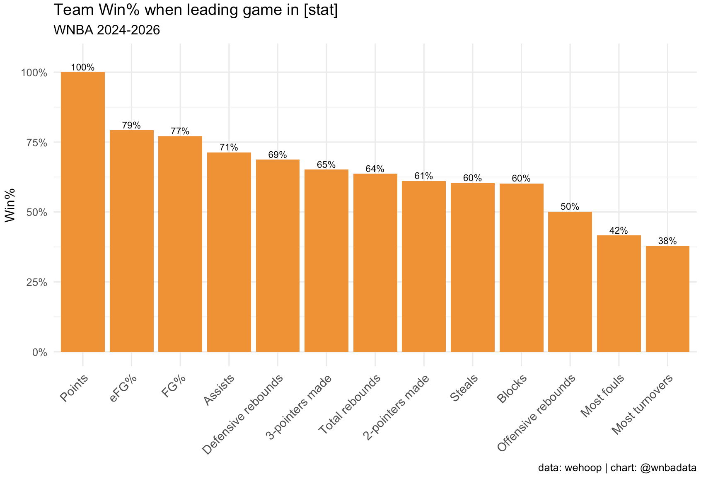
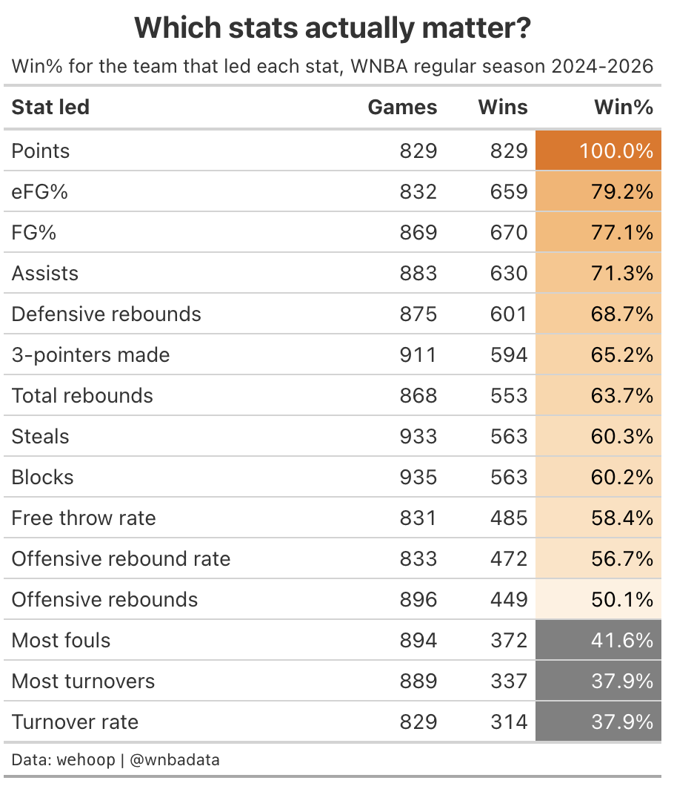

# Which stats actually matter?

**Win% for the team that led each stat in a game. WNBA regular season, 2024-2026.**

Inspired by Bob Bellotti's
[version of this question for the NBA](https://bellottibasketball.substack.com/p/which-nba-statistical-categories),
which made me want to know whether the same categories hold up in the W.

Video explainer: [@wnbadata on Instagram](https://www.instagram.com/p/DYFg-2SzWAI/).





## The question

On September 9, 2025, the Lynx out-rebounded the Fever 35-34, out-stole them 8-6,
out-assisted them 21-19, out-blocked them 6-1, and made more field goals. They still
lost 83-72.

Coaches put a lot of emphasis on winning the rebounding battle, or winning the turnover
battle. Games like that one made me want to check which box score categories actually
show up alongside wins, and which ones just sound like they should.

So, for each stat: in games where a team finished with more of it than their opponent,
how often did that team win?

## The data

`wehoop::load_wnba_team_box()`, regular season only. Every game is two rows, one per
team, which is what makes the "who led this stat" comparison easy.

The team box data only goes back to 2024, so this is 2024, 2025 and 2026, which comes
out to 829 games.

All star rosters get named after their captains (TEAM CLARK, Team Stewart, and so on),
so instead of hard coding one season's captains I filter out any team with the word
"team" in its name. 

## The method

The core of the script is a function, `leader_win_pct(data, stats)`, that takes
any set of stat columns and returns win% for the game leader in each one:

```r
leader_win_pct(wnba_team_box_four_factors, stats_to_check)
```

It reshapes to long format, flags the per-game leader in each stat, and adds up wins
over games.

On top of the raw box score columns, the script builds Dean Oliver's **Four Factors**,
which needs the opponent's row from the same game:

| Factor | Formula |
|---|---|
| Effective FG% | `(FGM + 0.5 × 3PM) / FGA` |
| Turnover rate | `TOV / (FGA + 0.44 × FTA + TOV)` |
| Offensive rebound rate | `ORB / (ORB + opponent DRB)` |
| Free throw rate | `FTA / FGA` |

The 0.44 is the usual estimate for how many free throw attempts actually end a
possession, since and-ones and technicals don't.

There are two follow ups in the same script. One pulls the games where a team
out-rebounded, out-stole, out-blocked *and* turned it over less than their opponent and
still lost, which are the counterexamples to "win the hustle stats, win the game." The
other looks at how big the eFG% gap is in the games where the less efficient team won
anyway.

## The finding

Points is the sanity check. The team that scores more points wins 100% of the time.

After that, the best one is effective field goal percentage. The team with the higher
eFG% won 79.2% of the time. Regular field goal percentage is right behind at 77.1%,
then assists at 71.3% and defensive rebounds at 68.7%.

Some very important-sounding stats are further down the list than I would think. Leading
total rebounds only gets you to 63.7%. Steals (60.3%) and blocks (60.2%) are just a little
better than a coin flip, and offensive rebounds (50.1%) are literally a coin flip.
Leading the game in fouls is actively bad news: those teams won 41.6% of the time (possibly in part due to end-game fouling scenarios).

Scoring is the name of the game, so it is intuitive that the stats that are actually
about putting the ball in the basket show up above the hustle stats. But that doesn't mean that other stats aren't important!

The four factors come out in the same order Dean Oliver ranked them. eFG% is the big
one. Turnover rate is next and it runs the other direction: the team with the higher
turnover rate won only 37.9% of the time, so taking care of the ball is worth almost as
much as shooting well. Then free throw rate at 58.4% and offensive rebound rate at
56.7%.

## Caveats

Leading a stat and winning are both downstream of being the better team, so I am not claiming that any of
this is causal. Teams also perform differently in "garbage time"; a team that is ahead late shoots and rebounds differently than a team that is chasing. Score adjusted or possession level analysis would separate those
effects.

## Run it

```r
source("which-stats-actually-matter.R")
```

Requires: `wehoop`, `dplyr`, `tidyr`, `ggplot2`, `gt`, `stringr`, `scales`.

The first `load_wnba_team_box()` call takes a minute or two.
