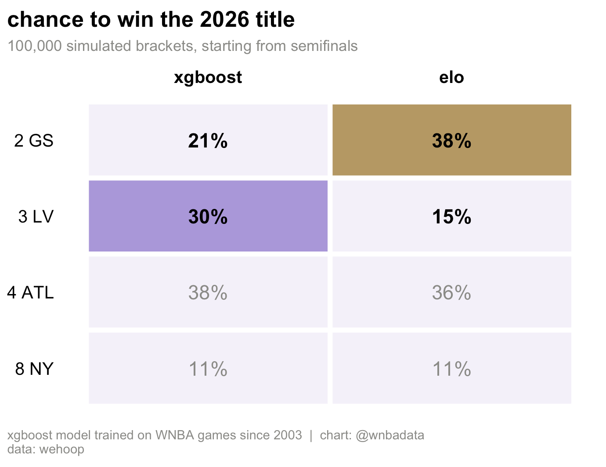
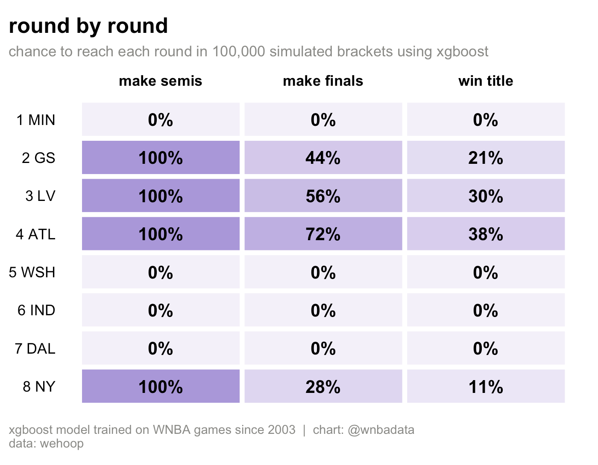
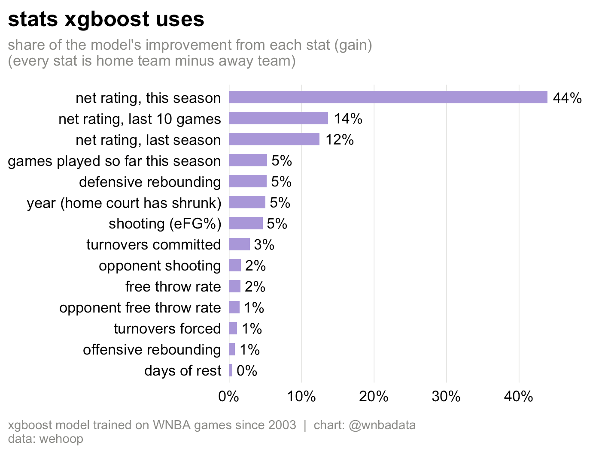
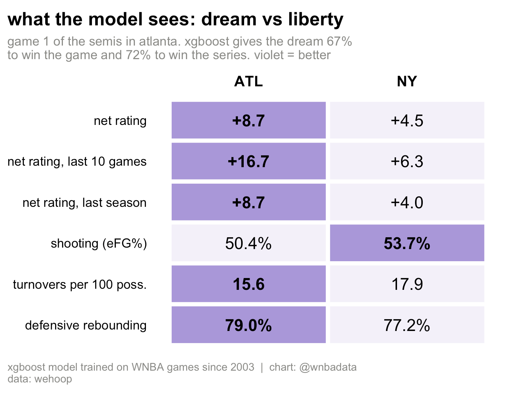
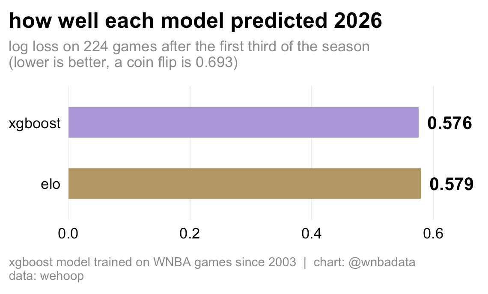
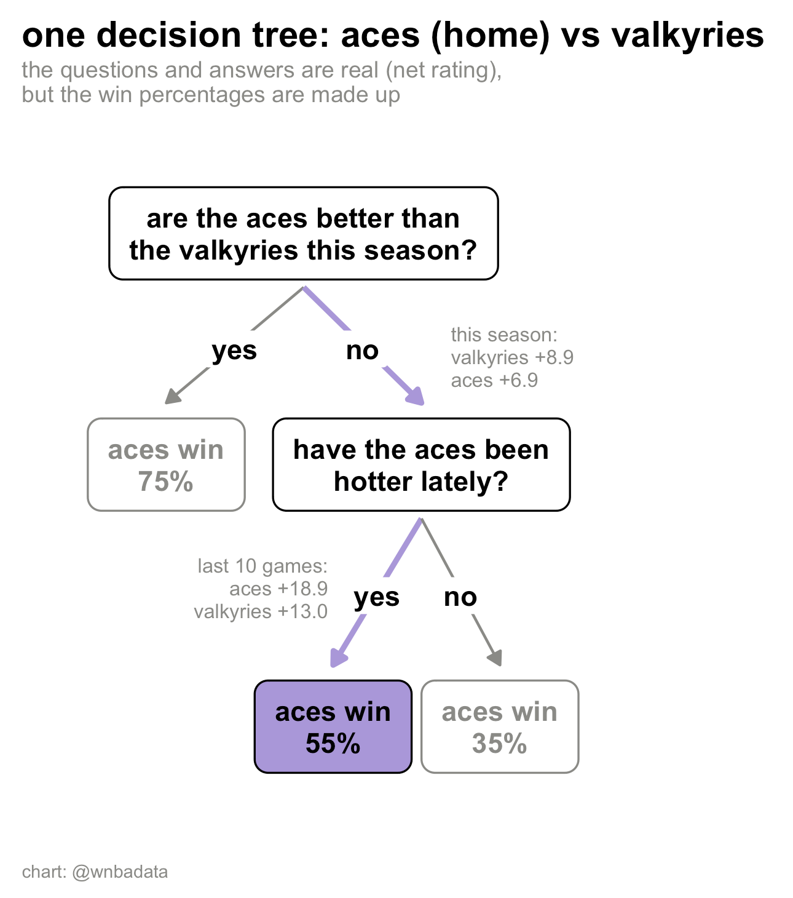
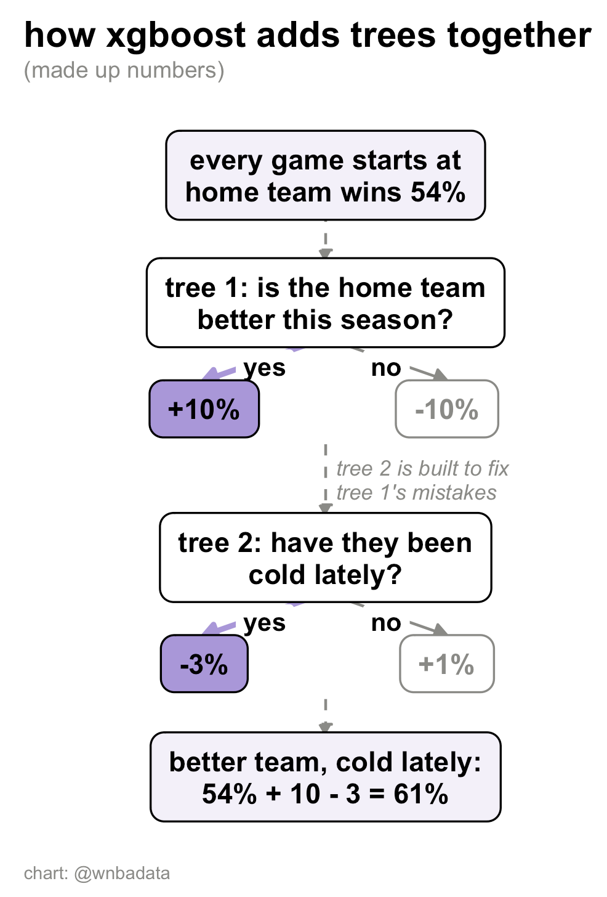

# Predicting the 2026 WNBA playoffs with XGBoost

**An XGBoost model of single games, trained on WNBA games since 2003 and plugged into the same
bracket simulation as the [Elo model](../elo-playoff-sim). On 2026 games it ties Elo
(log loss 0.576 vs 0.579, not a significant difference).**

Video explainer: [@wnbadata](https://www.instagram.com/p/DeC6l80Sedz/).

## About this project

I'm not an XGBoost specialist. I covered gradient boosted trees briefly in UW's CSE 546
(Autumn 2024, [my coursework](https://github.com/madbro206/maddy_machinelearning)), but this is
the first XGBoost model I've built myself, made to see whether
machine learning beats the simpler [Bradley-Terry](../bradley-terry-playoff-sim) and
[Elo](../elo-playoff-sim) models I had already built. The choices I made are listed below so you
can see (and disagree with) them, along with what I did and didn't test.

## Title odds after the first round, before the second round

| Team (seed) | XGBoost | Elo |
|---|---|---|
| Atlanta Dream (4) | 38% | 36% |
| Las Vegas Aces (3) | 30% | 15% |
| Golden State Valkyries (2) | 21% | 38% |
| New York Liberty (8) | 11% | 11% |

100,000 simulated brackets for each model, from where the playoffs stood after the first round
(October 2, 2026). Both models favor the Dream over the Liberty in the semifinals (72% XGBoost,
67% Elo), but they pick different winners in Aces vs Valkyries. XGBoost has the Aces at 56%,
mostly because of their shooting (55.1% eFG, best of the four teams left) and partly because of
last season, when the Valkyries were an expansion team. Elo ignores last season and has the
Valkyries at 65%. `xgb-sim.R` is frozen at this date with `as_of <- as.Date("2026-10-02")`,
so a rerun reproduces these numbers. Set `as_of` to a later date for updated odds.





## The stats

The model predicts the home team's chance to win from 14 inputs. Twelve are a home team minus
away team gap, using only games played before the one being predicted.

| Input | Description |
|---|---|
| **Overall strength** | |
| net rating | points scored minus points allowed per 100 possessions, season to date |
| net rating, last 10 games | the same, over each team's last 10 games |
| net rating, last season | each team's full previous season (missing for expansion teams) |
| **Offense (four factors)** | |
| shooting | eFG% = (FGM + 0.5 × 3PM) / FGA |
| turnovers | turnovers per possession |
| offensive rebounding | share of their own misses they rebound |
| free throw rate | free throws made per field goal attempt |
| **Defense (four factors allowed)** | |
| opponent shooting | opponents' eFG% |
| turnovers forced | opponent turnovers per possession |
| defensive rebounding | share of opponents' misses they rebound |
| opponent free throw rate | opponents' free throws made per field goal attempt |
| **Context** | |
| rest | days since each team's last game, capped at 4 |
| games played so far | the smaller of the two teams' counts, so the model knows how much to trust season stats |
| season | the year, so home court can shrink over time (62% in 2003-09, 54% since 2021) |

Home court isn't a separate input: it's built into the baseline, since every game is seen from
the home team's side. Possessions are FGA - offensive rebounds + turnovers + 0.44 × FTA, averaged
over both teams. Player stats, injuries, pace and travel are not included.

Net rating does most of the work: the three net rating inputs account for about 70% of the
model's gain, and each four factor for 5% or less. Gain shows how useful a stat was for
splitting, not the size or direction of its effect (see the caveats).



Here's what that looks like for one real game, the Dream hosting the Liberty in Game 1 of the
semifinals. The Dream are better on five of these six stats, the Liberty shoot better, and the
model gives the Dream 67% for the game and 72% for the series.



## Choices I made

| Choice | What I did | Tested? |
|---|---|---|
| Inputs | home minus away gaps for net rating (this season, last 10 games, last season), the four factors, and rest, plus games played and the year | dropping the four factors made the 2026 test slightly worse (log loss 0.581 vs 0.576) |
| Home court | added the year as an input, since home teams won 62% of games in 2003-09 but 54% since 2021 | yes: without it, the model predicted 58.1% home wins on the 2026 test vs 55.4% actual; with it, 55.2% |
| 2020 bubble | left out of training (see below) | no |
| Data split | trained on 2003-2023, settings picked on 2024-25, tested once on 2026 games after the first third of the season | same split used to tune the Elo model's K, so the two are comparable |
| Settings | max depth 3, min child weight 25 (roughly 100+ games per leaf), learning rate 0.02, 80% of games and stats sampled per tree | compared 6 combinations of depth (1-3) and min child weight (5 or 25) on 2024-25, all within 0.005 log loss. learning rate and sampling were fixed, not tuned |
| Number of trees | stopped adding trees once 2024-25 log loss stopped improving (239) | yes |
| Monotone constraints | a better net rating or four factor can never lower a team's chance. rest, games played and year are unconstrained | not tested against an unconstrained model |
| Final model | retrained on every game through `as_of` except 2020, including the 2026 playoffs | no |
| Simulation | team stats frozen at `as_of`, equal rest for future games, higher seed hosts games 1, 2, 5 (semis) and 1, 2, 5, 7 (finals), 100,000 brackets | no |
| Elo comparison | same Elo as [elo-playoff-sim](../elo-playoff-sim). for the 2026 test, its home court comes from 2024-25 so it doesn't use 2026 results | no |

## Elo vs XGBoost

Both models judge teams mostly on 2026. What differs is where the rule for turning results
into a win chance comes from.

- **Elo** builds team ratings only from 2026 games (every team starts at 1500). Past seasons
  only set the rule: K = 30 was tuned on 2024-25.
- **XGBoost** also uses mostly 2026 stats (net rating, last 10 games, four factors), plus last
  season's net rating. But it learns the rule itself from about 5,000 games from 2003-2025.

Learning the rule from more than 20 years of games didn't make the predictions more accurate. On 224
games from 2026 the two models are statistically tied (z = -0.32). That doesn't prove they're
equally good in general, only that this test can't tell them apart.



## Loss function

The model minimizes log loss (binary cross-entropy), the same loss a logistic regression uses:

```
loss = -[y * log(p) + (1 - y) * log(1 - p)]
```

`y` is 1 if the home team won, and `p` is the model's home win chance. Confident misses cost
the most: saying 90% and losing costs 2.3, while saying 60% and losing costs 0.9. XGBoost adds a
small penalty on leaf values (its default, λ = 1). The same log loss picks the number of trees
on 2024-25 and scores both models on 2026.

## What the trees look like

Each of the 239 trees asks up to 3 yes/no questions about the two teams and nudges the home
team's odds by about half a percentage point. No single tree matters much: the largest
accounts for about 1% of the model's spread across games. The early trees do the most work
(the first 50 carry about 40% of it), and most of them ask about net rating first.

## The 2020 bubble

The 2020 season was played on neutral courts in Bradenton, so "home" was only a label (home
teams won exactly 50%). Those games are left out of training, about 147 games or 3% of the
data. 2020 still provides each team's "net rating last season" for 2021.

## Caveats

- **No injuries or roster changes are taken into account,** except as they show up in results.
- **Team stats are frozen at the `as_of` date for the whole simulation.** They don't update
  between simulated games, and rest is set equal for every future game.
- **No uncertainty in the model itself.** The simulation treats each game probability as exact,
  so the playoff odds are more confident than they should be.
- **The test is only 224 games,** too few to separate two models this close.
- **Feature importance (gain) shows how useful each stat was for splitting,** not the direction
  or size of its effect. Correlated stats share the credit, so the four factors look small partly
  because net rating already contains most of their information.

## What I'd try next

- Tune the settings with time-series cross-validation across several seasons, instead of one
  validation split
- Test whether the monotone constraints help
- Add uncertainty to the odds, for example by bootstrapping the training games
- Update team stats inside the simulation as simulated games are played
- Add player availability and injuries
- Bring back a logistic regression on the same inputs as a baseline (an early version scored
  0.599 on the 2026 test, worse than both models, but it isn't in the final script)

## How I explained it in the video

The [video](https://www.instagram.com/p/DeC6l80Sedz/) needed a way to explain boosting in a few seconds, so `explainer-diagrams.R` draws
two hand-built diagrams. They aren't the actual model output, and the win probabilities shown 
here are made up.



**One decision tree.** Two real yes/no questions about the Aces hosting the Valkyries: are they
better this season (no, +6.9 vs +8.9 net rating), and have they been hotter over their last 10
games (yes, +18.9 vs +13.0)? The answer at the bottom is made up too. The full model gives the Aces
61% in that game.



**How XGBoost adds trees together.** Every game starts at a baseline, each tree adds a small
nudge, and the second tree is built to fix the first tree's mistakes. The real model has 239 of
these and adds the nudges on the log-odds scale, not in percentage points.

## Run it

```r
source("xgb-sim.R")              # model, 2026 test, playoff odds and 5 charts
source("explainer-diagrams.R")   # the two hand-built diagrams from the video
```

`xgb-sim.R` pulls data live from wehoop (and from ESPN for playoff games that finished since
wehoop's nightly update), then keeps only games through `as_of`.

Requires: `wehoop`, `arrow`, `xgboost` (3.0 or later), `dplyr`, `tidyr`, `ggplot2`, `scales`.
